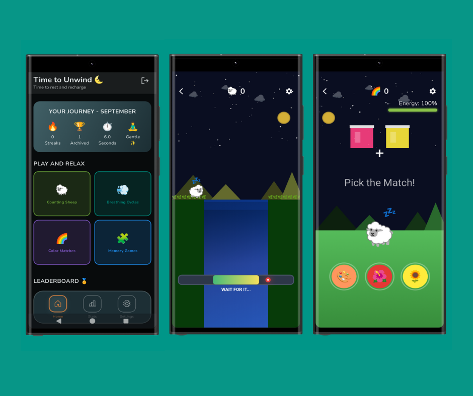

# 🐑 Sheeply

### リラックスできるミニゲームでゆったり楽しもう

> 心を落ち着かせ、リラックスするためにデザインされたミニゲーム集です。瞑想の合間やストレス解消、日常のひとときの安らぎに最適です。

## ✨ 特徴

### 🎮 4 つのリラックスミニゲーム

- **🐑 羊を数える** - デジタルで楽しむ伝統的なリラクゼーション法
- **🌈 カラーマッチング** - 心を落ち着ける色ベースのパズル
- **🧩 記憶ゲーム（絵文字）** - 可愛い絵文字でやさしい記憶チャレンジ
- **💨 呼吸サイクル** - マインドフルネスのための呼吸ガイド

### 🎯 詳細な統計と進捗管理

- **📊 日次連続記録** - 継続的なリラックス習慣を作る
- **📈 7 つのリラックスレベル** - 「Gentle」から「Satori」まで成長
- **🏆 50 以上のマイルストーン** - 成功体験をお祝い
- **📅 月間・年間分析** - リラックスパターンを追跡
- **🏅 リーダーボード** - 全ミニゲームでの友好的な競争

### ⚙️ カスタマイズ & アクセシビリティ

- **🎨 簡単設定カスタマイズ** - リラックス体験を個別設定
- **🌍 11 言語対応** - 世界中のユーザーが利用可能
- **📱 完全オフライン対応** - インターネットなしでどこでもリラックス

## 🌟 リラックスレベル

時間と努力に応じて設計された 7 つのリラックスレベルを進めよう：

| レベル | 絵文字 | 名前           | 条件                        | 説明                       |
| ------ | ------ | -------------- | --------------------------- | -------------------------- |
| 1      | ✨     | **Gentle**     | 今月 30 分未満              | 旅のスタート               |
| 2      | 🍃     | **Calm**       | 今月 30〜59 分              | 心がリフレッシュ           |
| 3      | 😊     | **Relaxed**    | 5 日以上 & 今月 60 分以上   | 穏やかさへの安定した進歩   |
| 4      | 🌸     | **Peaceful**   | 10 日以上 & 今月 120 分以上 | 深いリラックスとバランス   |
| 5      | 🌙     | **Tranquil**   | 15 日以上 & 今月 200 分以上 | 安らぎと集中               |
| 6      | 🧘‍♂️     | **Zen Master** | 20 日以上 & 今月 300 分以上 | 深い瞑想と調和             |
| 7      | 🌟     | **Satori**     | 25 日以上 & 今月 400 分以上 | 究極の落ち着きとマスタリー |

## 🏆 マイルストーンシステム

50 以上のマイルストーンで進捗を祝おう：

### 🐑 羊を数えるマイルストーン

- 1, 5, 10, 50, 100, 200, 500, 1000, 2000, 5000 頭の羊を数える

### 💨 呼吸エクササイズマイルストーン

- 1, 5, 10, 20, 50, 100, 200, 500, 1000 サイクルを完了

### 🌈 カラーマッチングマイルストーン

- 1, 5, 10, 20, 50, 100, 200, 500, 1000 マッチを解く

### 🧩 記憶ゲームマイルストーン

- 1, 5, 10, 20, 50, 100, 200, 500, 1000 回プレイ

### ⏱️ 時間 & 継続マイルストーン

- 総プレイ時間 1, 5, 10, 15, 20+ 時間
- 3, 5, 7+ 日の連続記録維持
- 合計 10, 50, 100, 200, 500+ ミニゲーム達成

## 🌍 言語サポート

Sheeply は 11 言語で提供され、世界中でリラックス可能：

- 🇺🇸 **English** (en)
- 🇨🇳 **Chinese** (zh)
- 🇪🇸 **Spanish** (es)
- 🇮🇳 **Hindi** (hi)
- 🇸🇦 **Arabic** (ar)
- 🇮🇩 **Indonesian** (id)
- 🇵🇹 **Portuguese** (pt)
- 🇷🇺 **Russian** (ru)
- 🇯🇵 **Japanese** (ja)
- 🇩🇪 **German** (de)
- 🇲🇾 **Malay** (ms)

## 📱 スクリーンショット

## 📞 サポート

- 📧 メール: flagodna.com@gmail.com
- 🐛 問題: [GitHub Issues](https://github.com/Flagodna-Developer/sheeply/issues)
- 💬 ディスカッション: [GitHub Discussions](https://github.com/Flagodna-Developer/sheeply/discussions)

---

**より平和な世界のために ❤️ で作られました**

[📧 サポートに連絡](mailto:flagodna.com@gmail.com) • [⭐ Play ストアで評価](https://play.google.com/store/apps/details?id=com.flagodna.sheeply)

